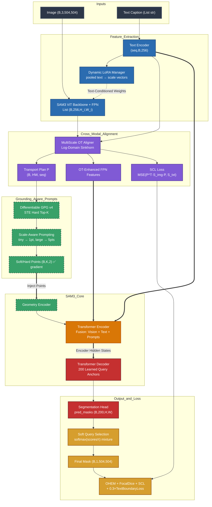

# Enhanced_RRSIS_UOT: Enhanced Referring Remote Sensing Image Segmentation with Unbalanced Optimal Transport

**Enhanced_RRSIS_UOT v4** extends [RRSIS_SAM3](../RRSIS_SAM3/) with **6 novel techniques** for improved performance on referring remote sensing image segmentation, targeting **82.5%+ oIoU** and **72.5%+ mIoU** on RRSIS-D.

## What's New (v4: Stable Differentiable GPG)

| Enhancement | Module | Description |
|-------------|--------|-------------|
| 🟢 **Text-Guided Dynamic LoRA** | `lib/dynamic_lora.py` | Text-conditioned vision adapter weights — vision encoder adapts per-caption |
| 🟢 **Log-Domain Sinkhorn Multi-Scale OT** | `lib/multiscale_ot_alignment.py` | 100% stable Sinkhorn operating in log-space to mathematically eliminate NaN crashes |
| 🟢 **STE Hard Top-K GPG** | `lib/prompt_generator.py` | Straight-Through Estimator: precise hard points in forward pass, differentiable soft-argmax in backward |
| 🟢 **Soft Query Selection** | `lib/enhanced_model.py` | Temperature-scaled softmax over 200 DETR queries to make mask selection fully differentiable |
| 🟢 **Text-Guided Boundary Loss** | `lib/text_boundary_loss.py` | Modulates Sobel boundaries with visual-language cross-attention maps for targeted edge sharpening |
| 🟢 **Joint Random Flips Augmentation** | `data/dataset.py` | Spatial flips applied synchronously to images and masks for geometric aerial invariance |

## Architecture



### Data Flow Summary

```
Image (B,3,504,504) + Caption (List[str])
  ├─ Step 0:   Normalize → [-1, 1] + Flips Augmentation
  ├─ Step 1:   Text Encoder → language_features (seq, B, 256)
  ├─ Step 1.5: Dynamic LoRA → cache pooled text (B, 256) in all LoRA layers
  ├─ Step 1.8: ViT + LoRA → backbone_fpn: List[(B, 256, H_i, W_i)]
  ├─ Step 2:   Multi-Scale OT → aligned FPN + Log-Domain transport plan P (B, HW, seq)
  ├─ Step 3:   Differentiable GPG (STE Top-K) + SAP → exact coordinates with soft gradients
  ├─ Step 4:   Encode Prompt → prompt tokens
  ├─ Step 5:   Transformer Encoder → fused hidden states
  ├─ Step 6:   DETR Decoder → 200 learned object queries
  ├─ Step 7:   Segmentation Head → pred_masks (B, 200, H, W)
  ├─ Step 8:   Soft Query Selection → softmax(scores/τ) mask mixture [gradient flows ✅]
  └─ Step 10:  Loss = SegLoss + 0.1 × SCL + 0.3 × TextGuidedBoundaryLoss
```

## Key Differences from RRSIS_SAM3

| Feature | RRSIS_SAM3 | Enhanced_RRSIS_UOT |
|---------|------------|---------------------|
| LoRA Type | Static (same weights for all inputs) | **Dynamic** (text-conditioned per-caption) |
| OT Alignment | Single-scale, one pass | **Multi-scale** across all FPN levels |
| OT Numerics | FP16 (NaN risk) | **FP32-safe Sinkhorn** with autocast disabled |
| Loss Function | Dice + BCE | **OHEM + FocalDice + Boundary + Contrastive + SCL** |
| Score Supervision | Uniform 1/N targets | **IoU-based query matching** (best query → 1.0) |
| Contrastive Features | Pooled encoder output (no spatial info) | **FPN features** with real spatial structure |
| Vision-Language Bond | Fusion encoder only | **Early** (LoRA) + **Mid** (OT) + **Late** (Contrastive) alignment |
| Point Grounding | None | **Differentiable GPG with Spatial Soft-Argmax** |

## Bug Fixes Applied (v2)

These critical bugs from v1 have been fixed in this release:

| Bug | Severity | Fix |
|-----|----------|-----|
| **Sinkhorn FP16 underflow** → NaN crash | 🔴 Critical | Force FP32 + `autocast(enabled=False)` inside Sinkhorn |
| **Score supervision** → all queries trained to 1/N | 🟠 High | IoU-based matching: best query → 1.0, others → 0.0 |
| **Contrastive loss** → constant spatial map | 🟡 Medium | Use real FPN features instead of pooled+expanded |
| **SCL weight** → hardcoded 0.1 | 🟢 Low | Configurable `scl_weight` parameter |
| **Deprecated APIs** → PyTorch warnings | 🟢 Low | Updated `torch.amp.GradScaler` and `torch.amp.autocast` |

## Supported Datasets

| Dataset | Train | Val | Test | Image Size | Categories |
|---------|-------|-----|------|------------|------------|
| **RRSIS-D** | 12,181 | 1,740 | 3,481 | 800×800 | 20 |
| **RRSIS-HR** | 2,118 | 268 | 264 | 1024×1024 | 7 |
| **RefSegRS** | 2,172 | 413 | 1,817 | 512×512 | — |

## Training

### 🏆 Recommended Training Command (Best Performance)

Optimized hyperparameters for **RRSIS-D** on **Kaggle T4/P100** (16GB VRAM):

```bash
env MPLBACKEND="agg" WANDB_MODE=disabled python train.py \
      --dataset rrsis_d \
      --data_root /kaggle/input/datasets/saadali22/datad-rms/datad \
      --sam3_ckpt /kaggle/input/datasets/abdulahad0011/sam3-weight/sam3.pt \
      --output_dir ./output/rrsis_d_enhanced_v3 \
      --image_size 504 \
      --lora_rank 16 \
      --lora_alpha 32.0 \
      --epochs 50 \
      --batch_size 2 \
      --grad_accum_steps 8 \
      --lr 5e-5 \
      --lr_backbone 1e-5 \
      --lr_decoder 5e-5 \
      --weight_decay 0.01 \
      --weight_decay_decoder 0.005 \
      --warmup_epochs 3 \
      --eta_min 3e-6 \
      --patience 8 \
      --contrastive_weight 0.1 \
      --ohem_hard_ratio 0.3 \
      --ot_reg 0.1 \
      --ot_num_iter 10 \
      --num_ot_scales 3 \
      --boundary_loss_weight 0.5 \
      --focal_gamma 2.0 \
      --fp16 \
      --gradient_checkpointing \
      --seed 42 \
      --num_workers 4 \
      --use_dynamic_lora \
      --use_contrastive_loss \
      --use_multiscale_ot \
      --use_ohem_loss \
      2>&1 | tee -a ./output_rrsis_d_v3.log
```

### ⚡ Quick Training (Faster, Slightly Lower Performance)

```bash
env MPLBACKEND="agg" python train.py \
      --dataset rrsis_d \
      --data_root ./data/ \
      --sam3_ckpt ./pre-trained-weights/sam3.pt \
      --output_dir ./output/quick_run \
      --epochs 25 \
      --batch_size 2 \
      --grad_accum_steps 4 \
      --lr 5e-5 \
      --ohem_hard_ratio 0.25 \
      --fp16 \
      --gradient_checkpointing
```

### 🔬 Ablation Studies

Toggle individual enhancements to measure impact:

```bash
# Baseline (equivalent to RRSIS_SAM3):
python train.py --dataset rrsis_d --data_root ./data/ --sam3_ckpt ./sam3.pt \
    --no_dynamic_lora --no_contrastive_loss --no_multiscale_ot --no_ohem_loss

# Only Dynamic LoRA:
python train.py --dataset rrsis_d --data_root ./data/ --sam3_ckpt ./sam3.pt \
    --no_contrastive_loss --no_multiscale_ot --no_ohem_loss

# Only OHEM Loss:
python train.py --dataset rrsis_d --data_root ./data/ --sam3_ckpt ./sam3.pt \
    --no_dynamic_lora --no_contrastive_loss --no_multiscale_ot

# Dynamic LoRA + Multi-Scale OT (no extra losses):
python train.py --dataset rrsis_d --data_root ./data/ --sam3_ckpt ./sam3.pt \
    --no_contrastive_loss --no_ohem_loss

# Full model (default — all enhancements enabled):
python train.py --dataset rrsis_d --data_root ./data/ --sam3_ckpt ./sam3.pt
```

### 📊 Recommended Hyperparameters

#### Loss Weights (Tuned)

| Parameter | Default | Recommended Range | Guidance |
|-----------|---------|-------------------|----------|
| `--contrastive_weight` | 0.0 | **0.0 – 0.1** | Weight for InfoNCE loss; set to 0.0 for Phase 1 stability |
| `--boundary_weight` | 0.3 | **0.2 – 0.5** | Weight for text-guided boundary loss; higher = sharper referred edges |
| `--selection_temp` | 0.1 | **0.05 – 0.2** | Softmask softmax temperature; lower = closer to argmax but smooth |
| `--ohem_hard_ratio` | 0.3 | **0.2 – 0.4** | Fraction of hardest pixels; 0.3 balances hard-mining vs stability |
| `--dice_weight` | 0.5 | **0.3 – 0.7** | Dice vs CE trade-off; higher = more overlap focus |
| `--ce_weight` | 0.5 | **0.3 – 0.7** | CE vs Dice trade-off; sum with dice_weight should ~= 1.0 |

#### OT Alignment

| Parameter | Default | Recommended Range | Guidance |
|-----------|---------|-------------------|----------|
| `--ot_reg` | 0.1 | **0.05 – 0.2** | Sinkhorn entropy regularization; lower = sharper transport |
| `--ot_num_iter` | 10 | **5 – 20** | Sinkhorn iterations; 10 is sufficient for reg=0.1 |
| `--num_ot_scales` | 3 | **2 – 4** | FPN scales; match your FPN output levels |

#### LoRA & Learning Rates

| Parameter | Default | Recommended Range | Guidance |
|-----------|---------|-------------------|----------|
| `--lora_rank` | 16 | **8 – 32** | Higher = more capacity but more params; 16 is sweet spot |
| `--lora_alpha` | 32.0 | **2× lora_rank** | Standard: α = 2r; keeps LoRA scaling ~1.0 |
| `--lr` | 5e-5 | **1e-5 – 1e-4** | Base learning rate for new modules |
| `--lr_backbone` | 1e-5 | **5e-6 – 2e-5** | LoRA params in backbone; lower than base LR |
| `--lr_decoder` | 5e-5 | **2e-5 – 1e-4** | Decoder + seg head; can be equal to or higher than base |
| `--weight_decay` | 0.01 | **0.005 – 0.02** | AdamW weight decay; standard 0.01 |
| `--warmup_epochs` | 3 | **2 – 5** | LR warmup; 3 epochs for fine-tuning pretrained models |

#### Memory & Batch

| Parameter | Default | Guidance |
|-----------|---------|----------|
| `--batch_size` | 4 | **T4 (16GB):** 2–4, **A100 (40GB):** 4–8 |
| `--grad_accum_steps` | 2 | Effective batch = batch_size × accum_steps; target **8–16** |
| `--fp16` | True | **Always use** — Sinkhorn is FP32 Log-Domain safe now |
| `--gradient_checkpointing` | True | **Always use** on ≤24GB GPUs |

#### Best Configurations by GPU

| GPU | VRAM | `batch_size` | `grad_accum_steps` | Effective Batch |
|-----|------|-------------|-------------------|-----------------|
| **T4** | 16GB | 4 | 2 | 8 |
| **P100** | 16GB | 4 | 2 | 8 |
| **V100** | 32GB | 4 | 4 | 16 |
| **A100** | 40GB | 8 | 2 | 16 |

### Resume Training from Checkpoint

```bash
python train.py \
      --dataset rrsis_d \
      --data_root ./data/ \
      --sam3_ckpt ./pre-trained-weights/sam3.pt \
      --resume ./output/rrsis_d_enhanced_v4/checkpoint_epoch_20.pth \
      --epochs 40 \
      --fp16 --gradient_checkpointing
```

## Evaluation

### Full Evaluation on Test Set

```bash
python test.py \
      --dataset rrsis_d \
      --data_root ./data/ \
      --sam3_ckpt ./pre-trained-weights/sam3.pt \
      --split test \
      --resume ./output/rrsis_d_enhanced_v4/best_model.pth \
      --fp16
```

### Evaluation with Visualization (saves predicted masks)

```bash
python test.py \
      --dataset rrsis_d \
      --split test \
      --resume ./output/best_model.pth \
      --visualize \
      --fp16
```

### Expected Output Format

```
= = = = = = = = = = = = = = = = = = = = = = = = = = = = = = = = = = = = = = = =
  Results on rrsis_d (test)
= = = = = = = = = = = = = = = = = = = = = = = = = = = = = = = = = = = = = = = =
  mIoU:  72.65%
  oIoU:  82.78%
  P@0.5: 83.23%
  P@0.6: 78.45%
  P@0.7: 70.10%
  P@0.8: 56.34%
  P@0.9: 35.67%
  Samples: 3481
  Avg Time: 45.2ms
= = = = = = = = = = = = = = = = = = = = = = = = = = = = = = = = = = = = = = = =
```

### Output Metrics

| Metric | Description |
|--------|-------------|
| **mIoU** | Mean Intersection over Union (per-sample average) |
| **oIoU** | Overall IoU (cumulative intersection / cumulative union) |
| **P@0.5** | % of samples with IoU > 0.5 |
| **P@0.6 – P@0.9** | Precision at stricter IoU thresholds |
| **Avg Time** | Average inference time per sample (ms) |

## Project Structure

```
Enhanced_RRSIS_UOT/
├── sam3/                           # SAM3 core (Meta's implementation)
├── lib/
│   ├── enhanced_model.py           # ★ Enhanced model (main entry point)
│   ├── dynamic_lora.py             # ★ Text-Guided Dynamic LoRA
│   ├── contrastive_loss.py         # ★ InfoNCE Contrastive Loss
│   ├── multiscale_ot_alignment.py  # ★ Multi-Scale OT Alignment (Log-Domain Sinkhorn)
│   ├── ohem_loss.py                # ★ OHEM + Focal + Boundary Loss
│   ├── prompt_generator.py         # ★ Differentiable GPG (v4) (STE Top-K)
│   ├── text_boundary_loss.py       # ★ Text-Guided Boundary Loss
│   ├── rrsis_sam3_model.py         # Base model (from RRSIS_SAM3)
│   ├── rs_adapters.py              # Static LoRA adapters (fallback)
│   ├── ot_feature_alignment.py     # Single-scale OT (fallback, Log-Domain safe)
│   └── ot_loss.py                  # Standard Dice+BCE (fallback)
├── data/                           # Dataset loaders
├── refer/                          # REFER API
├── loss/                           # Legacy loss functions
├── configs/
│   └── enhanced_rrsis_uot.yaml     # Full configuration
├── train.py                        # Training script
├── test.py                         # Evaluation script
├── args.py                         # CLI arguments
├── fine.sh                         # Training launcher
├── test.sh                         # Evaluation launcher
└── README.md                       # This file
```

## All CLI Arguments

| Category | Argument | Default | Type | Description |
|----------|----------|---------|------|-------------|
| **Paths** | `--data_root` | `./data/` | str | Root directory of datasets |
| | `--output_dir` | `./output/` | str | Output directory for checkpoints |
| | `--sam3_ckpt` | `./pre-trained-weights/sam3.pt` | str | SAM3 pretrained checkpoint |
| | `--resume` | `` | str | Resume from checkpoint |
| **Dataset** | `--dataset` | `refcoco` | str | Dataset: `rrsis_d`, `rrsis_hr`, `refsegrs` |
| | `--split` | `train` | str | Data split |
| | `--max_tokens` | `32` | int | Max text token length |
| **Model** | `--image_size` | `504` | int | Input size (divisible by 14) |
| | `--lora_rank` | `16` | int | LoRA rank |
| | `--lora_alpha` | `32.0` | float | LoRA alpha scaling |
| **Enhancements** | `--use_dynamic_lora` | `True` | flag | Enable Dynamic LoRA |
| | `--use_contrastive_loss` | `True` | flag | Enable InfoNCE loss |
| | `--use_multiscale_ot` | `True` | flag | Enable Multi-Scale OT |
| | `--use_ohem_loss` | `True` | flag | Enable OHEM loss |
| | `--use_boundary_loss` | `True` | flag | Enable Text-Guided Boundary Loss |
| | `--no_dynamic_lora` | `False` | flag | Disable Dynamic LoRA |
| | `--no_contrastive_loss` | `False` | flag | Disable contrastive loss |
| | `--no_multiscale_ot` | `False` | flag | Disable multi-scale OT |
| | `--no_ohem_loss` | `False` | flag | Disable OHEM loss |
| | `--no_boundary_loss` | `False` | flag | Disable boundary loss |
| **Enhancement Params** | `--contrastive_weight` | `0.0` | float | InfoNCE loss weight (disabled in Phase 1) |
| | `--boundary_weight` | `0.3` | float | Text-Guided Boundary loss weight |
| | `--selection_temp` | `0.1` | float | Soft query selection temperature |
| | `--ohem_hard_ratio` | `0.3` | float | OHEM hard pixel fraction |
| | `--ot_reg` | `0.1` | float | Sinkhorn regularization |
| | `--ot_num_iter` | `10` | int | Sinkhorn iterations |
| | `--num_ot_scales` | `3` | int | FPN scales for OT |
| | `--focal_gamma` | `2.0` | float | Focal loss gamma |
| **Training** | `--epochs` | `50` | int | Training epochs |
| | `--batch_size` | `4` | int | Batch size per GPU |
| | `--lr` | `5e-5` | float | Base learning rate |
| | `--lr_backbone` | `1e-5` | float | Backbone (LoRA) LR |
| | `--lr_decoder` | `5e-5` | float | Decoder/seg head LR |
| | `--weight_decay` | `1e-2` | float | AdamW weight decay |
| | `--warmup_epochs` | `3` | int | LR warmup epochs |
| | `--grad_accum_steps` | `2` | int | Gradient accumulation |
| **Optimization** | `--fp16` | `True` | flag | Mixed precision (FP16) |
| | `--gradient_checkpointing` | `True` | flag | Gradient checkpointing |
| | `--seed` | `42` | int | Random seed |
| **Evaluation** | `--eval_only` | `False` | flag | Evaluation mode only |
| | `--visualize` | `False` | flag | Save prediction visualizations |

## Citation

```bibtex
@article{enhanced_rrsis_uot_2026,
    title={Enhanced RRSIS-UOT v4: Stable Differentiable Grounding-Aware Prompting for Referring Remote Sensing Image Segmentation with Unbalanced Optimal Transport},
    year={2026}
}
```
