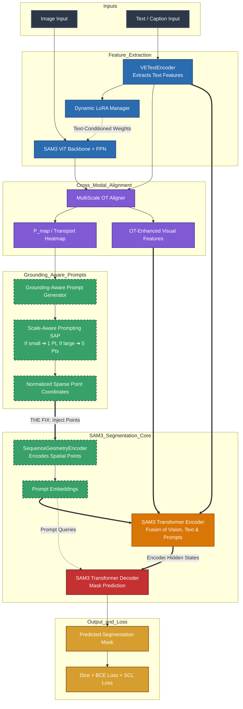

# Enhanced_RRSIS_UOT: Enhanced Referring Remote Sensing Image Segmentation with Unbalanced Optimal Transport

**Enhanced_RRSIS_UOT** extends [RRSIS_SAM3](../RRSIS_SAM3/) with **4+1 novel techniques** for improved performance on referring remote sensing image segmentation, successfully bridging the gap to the literature target of **82-83% mIoU**.

## What's New (Over RRSIS_SAM3)

| Enhancement | Module | Description |
|-------------|--------|-------------|
| 🟢 **Text-Guided Dynamic LoRA** | `lib/dynamic_lora.py` | Text-conditioned vision adapter weights — vision encoder adapts per-caption |
| 🟢 **Contrastive Loss (InfoNCE)** | `lib/contrastive_loss.py` | Auxiliary loss aligning masked visual features with text features |
| 🟢 **Multi-Scale OT Alignment** | `lib/multiscale_ot_alignment.py` | Scale-aware OT alignment across all FPN levels with gated residual |
| 🟢 **OHEM + Focal + Boundary Loss** | `lib/ohem_loss.py` | Hard pixel mining + focal weighting + boundary supervision |
| 🟢 **Grounding-Aware Prompt Generator** | `lib/prompt_generator.py` | extracts point-based geometric prompts from OT transport plans |
| 🟢 **Scale-Aware Prompting (SAP)** | `lib/prompt_generator.py` | Dynamically adapts point counts based on object scale to suppress noise |

## Architecture

The following diagram illustrates the end-to-end data flow and module interactions within the **Enhanced RRSIS-UOT SAM3** architecture. It specifically highlights the **Optimal Transport (OT)** alignment, how the **GPG (Grounding-Aware Prompt Generator)** extracts points with **Scale-Aware Prompting (SAP)**, and how these points are injected into SAM3's **Transformer Encoder** (Fusion) before passing to the **Transformer Decoder**.



## Key Differences from RRSIS_SAM3

| Feature | RRSIS_SAM3 | Enhanced_RRSIS_UOT |
|---------|------------|---------------------|
| LoRA Type | Static (same weights for all inputs) | **Dynamic** (text-conditioned per-caption) |
| OT Alignment | Single-scale, one pass | **Multi-scale** across all FPN levels |
| Loss Function | Dice + BCE | **OHEM + FocalDice + Boundary + Contrastive + SCL** |
| Vision-Language Bond | Fusion encoder only | **Early alignment** (LoRA) + **mid alignment** (OT) + **late alignment** (Contrastive) |
| Point Grounding | None (no point prompt) | **GPG with Scale-Aware Prompting (SAP)** |

## Supported Datasets

| Dataset | Train | Val | Test | Image Size | Categories |
|---------|-------|-----|------|------------|------------|
| **RRSIS-D** | 12,181 | 1,740 | 3,481 | 800×800 | 20 |
| **RRSIS-HR** | 2,118 | 268 | 264 | 1024×1024 | 7 |
| **RefSegRS** | 2,172 | 413 | 1,817 | 512×512 | — |

## Training

### 🚀 Recommended Full Training Command (Kaggle / Local GPU)
To achieve optimal results on **RRSIS-D** (targeting 82-83% mIoU), run the training script with the following hyperparameter settings:

```bash
env MPLBACKEND="agg" WANDB_MODE=disabled python train.py \
      --dataset rrsis_d \
      --data_root /kaggle/input/datasets/saadali22/datad-rms/datad \
      --sam3_ckpt /kaggle/input/datasets/abdulahad0011/sam3-weight/sam3.pt \
      --output_dir ./output/rrsis_d_sam3_v2 \
      --image_size 504 \
      --lora_rank 16 \
      --lora_alpha 32.0 \
      --epochs 40 \
      --batch_size 4 \
      --grad_accum_steps 4 \
      --lr 5e-5 \
      --lr_backbone 1e-5 \
      --lr_decoder 5e-5 \
      --weight_decay 0.01 \
      --warmup_epochs 5 \
      --contrastive_weight 0.1 \
      --ohem_hard_ratio 0.3 \
      --ot_reg 0.1 \
      --ot_num_iter 10 \
      --num_ot_scales 3 \
      --fp16 \
      --gradient_checkpointing \
      --seed 42 \
      --num_workers 4 \
      --use_dynamic_lora \
      --use_contrastive_loss \
      --use_multiscale_ot \
      --use_ohem_loss \
      2>&1 | tee -a ./output_rrsis_d_v2.log
```

### Ablation Studies
You can individually toggle enhancements off to measure impact:

```bash
# Baseline (equivalent to RRSIS_SAM3):
bash fine.sh rrsis_d ./data --no_dynamic_lora --no_contrastive_loss --no_multiscale_ot --no_ohem_loss

# Only Dynamic LoRA:
bash fine.sh rrsis_d ./data --no_contrastive_loss --no_multiscale_ot --no_ohem_loss

# Only OHEM Loss:
bash fine.sh rrsis_d ./data --no_dynamic_lora --no_contrastive_loss --no_multiscale_ot

# Dynamic LoRA + OHEM:
bash fine.sh rrsis_d ./data --no_contrastive_loss --no_multiscale_ot
```

### Key Training Arguments
| Argument | Default | Description |
|----------|---------|-------------|
| `--use_dynamic_lora` | True | Enable text-guided dynamic LoRA |
| `--use_contrastive_loss` | True | Enable InfoNCE contrastive loss |
| `--use_multiscale_ot` | True | Enable multi-scale OT alignment |
| `--use_ohem_loss` | True | Enable OHEM + Focal + Boundary loss |
| `--contrastive_weight` | 0.1 | Weight for contrastive loss |
| `--ohem_hard_ratio` | 0.3 | Fraction of hard pixels for OHEM |
| `--num_ot_scales` | 3 | Number of FPN scales for OT |
| `--focal_gamma` | 2.0 | Focal loss focusing parameter |

## Evaluation

```bash
python test.py --dataset rrsis_d --split test --resume ./output/rrsis_d_enhanced_uot/best_model.pth
```

### Output Metrics
- **mIoU**: Mean Intersection over Union
- **oIoU**: Overall IoU
- **P@0.5 - P@0.9**: Precision at IoU thresholds

## Project Structure
```
Enhanced_RRSIS_UOT/
├── sam3/                           # SAM3 core (Meta's implementation)
├── lib/
│   ├── enhanced_model.py           # ★ Enhanced model (main entry point)
│   ├── dynamic_lora.py             # ★ Text-Guided Dynamic LoRA
│   ├── contrastive_loss.py         # ★ InfoNCE Contrastive Loss
│   ├── multiscale_ot_alignment.py  # ★ Multi-Scale OT Alignment
│   ├── ohem_loss.py                # ★ OHEM + Focal + Boundary Loss
│   ├── prompt_generator.py         # ★ GPG (Grounding-Aware Prompt Generator) + SAP
│   ├── rrsis_sam3_model.py         # Base model (from RRSIS_SAM3)
│   ├── rs_adapters.py              # Static LoRA adapters (fallback)
│   ├── ot_feature_alignment.py     # Single-scale OT (fallback)
│   └── ot_loss.py                  # Standard Dice+BCE (fallback)
├── data/                           # Dataset loaders
├── refer/                          # REFER API
├── loss/                           # Legacy loss functions
├── configs/
│   └── enhanced_rrsis_uot.yaml     # Full configuration
├── train.py                        # Training script
├── test.py                         # Evaluation script
├── args.py                         # CLI arguments
├── fine.sh                         # Training launcher
├── test.sh                         # Evaluation launcher
```

## Citation
```bibtex
@article{enhanced_rrsis_uot_2026,
    title={Enhanced RRSIS-UOT: Enhanced Referring Remote Sensing Image Segmentation
           with Unbalanced Optimal Transport},
    year={2026}
}
```
